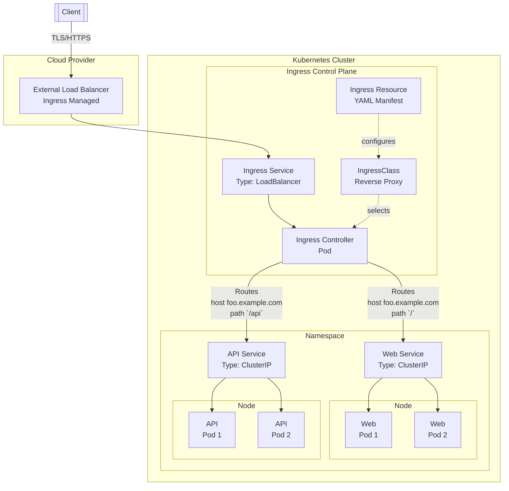

# Kubernetes

- [1. Details](#1-details)
  - [1.1. Charts](#11-charts)
  - [1.2. Architecture Diagrams](#12-architecture-diagrams)
  - [1.3. Order of Precedence](#13-order-of-precedence)
  - [1.4. Prerequisites](#14-prerequisites)
- [2. Usage](#2-usage)
  - [2.1. Authentication](#21-authentication)
    - [2.1.1. Kube Config](#211-kube-config)
  - [2.2. Cryptographic](#22-cryptographic)
    - [2.2.1. TLS Certificates and Private Keys](#221-tls-certificates-and-private-keys)
    - [2.2.2. CA-Signed Certificates from CSRs](#222-ca-signed-certificates-from-csrs)
- [3. Contribute](#3-contribute)
  - [3.1. Task Runner](#31-task-runner)
    - [3.1.1. Make](#311-make)
  - [3.2. Bootstrap](#32-bootstrap)
    - [3.2.1. Scripts](#321-scripts)
  - [3.3. Release Manager](#33-release-manager)
    - [3.3.1. Semantic-Release](#331-semantic-release)
  - [3.4. Update Manager](#34-update-manager)
    - [3.4.1. Renovate](#341-renovate)
    - [3.4.2. Dependabot](#342-dependabot)
  - [3.5. Secrets Manager](#35-secrets-manager)
    - [3.5.1. SOPS](#351-sops)
  - [3.6. Container Manager](#36-container-manager)
    - [3.6.1. Docker](#361-docker)
  - [3.7. Policy Manager](#37-policy-manager)
    - [3.7.1. Conftest](#371-conftest)
  - [3.8. Supply Chain Manager](#38-supply-chain-manager)
    - [3.8.1. Trivy](#381-trivy)
- [4. Troubleshoot](#4-troubleshoot)
  - [4.1. TODO](#41-todo)
- [5. References](#5-references)

## 1. Details

### 1.1. Charts

TODO

### 1.2. Architecture Diagrams



- Client
  > The *external* entity making an HTTP/HTTPS request to an application.

- Load Balancer
  > A *external* managed service provided by a cloud provider (AWS, GCP, Azure) outside of the Kubernetes cluster, created automatically by the Service of type `LoadBalancer`. Operates at Layer 4 (TCP/UDP) or Layer 7 (HTTP/HTTPS).

- Ingress Resource
  > A declarative Kubernetes API object that specifies routing rules (e.g., host-based, path-based) for external traffic. Centralized management as a single entry point for all HTTP/HTTPS traffic, security (TLS termination) and observability (logging, metrics).

- Ingress Service
  > A Kubernetes Service that targets the Pods of the Ingress Controller. Setting its type to `LoadBalancer`, instructs to provision an external load balancer to route traffic to the nodes on the specific `NodePort` of the service.

- IngressClass
  > A Kubernetes resource that defines the Ingress Controller to use for a specific Ingress Resource. It specifies the controller implementation (e.g., Nginx, Traefik) and its configuration.

- Ingress Controller
  > A reverse proxy server (Nginx, Traefik, or Envoy) running as a active component in a Pod within the cluster. Responsible for fulfilling the rules defined in the Ingress Resource.

- Services
  > - **LoadBalancer**: The Ingress Service of type `LoadBalancer` is created to provisions an external load balancer and expose the Ingress Controller to external traffic.
  > - **ClusterIP**: The Ingress Controller sends traffic to a regular Kubernetes Service of type `ClusterIP`. The Service is the internal default cluster communication to endpoints and load balancer, distributing traffic to the healthy Pods that match its *label selector*.

- Pods
  > The Ingress Controller routes traffic to internal ClusterIP Services, which then forward it to the application Pods.

### 1.3. Order of Precedence

Kustomize assembles and applies configuration in a defined hierarchy to ensure predictable overrides, lowest to highest:

- Base Resources
  > Loaded first from `resources:` in base kustomizations.

- Generators
  > ConfigMap- and Secret-generators (`configMapGenerator:`, `secretGenerator:`) produce new objects after base resources.

- Base Patches
  > Any `patches:` declared within base kustomizations are applied.

- Component Patches & Transformers
  > Imported via `components:`, these patches and transformers run next.

- Overlay Patches & Transformers
  > Specified in overlays (`patches:`, `transformers:`), they override earlier modifications.

- Overlay Direct Fields
  > Top-level settings in the overlay such as `namespace:`, `namePrefix:`, `commonLabels:`, `images:` are applied last, possessing the highest precedence.

### 1.4. Prerequisites

TODO

## 2. Usage

### 2.1. Authentication

#### 2.1.1. Kube Config

TODO

### 2.2. Cryptographic

#### 2.2.1. TLS Certificates and Private Keys

TODO

#### 2.2.2. CA-Signed Certificates from CSRs

TODO

## 3. Contribute

Contribution guidelines and project management tools.

### 3.1. Task Runner

#### 3.1.1. Make

[Make](https://www.gnu.org/software/make/) is a automation tool that defines and manages tasks to streamline development workflows.

1. Insights and Details

    - [Makefile](Makefile)
      > Makefile defining tasks for building, testing, and managing the project.

2. Usage and Instructions

    - Tasks

      ```bash
      make help
      ```

      > [!NOTE]
      > - Each task description must begin with `##` to be included in the task list.

      ```plaintext
      $ make help

      Tasks
              A collection of tasks used in the current project.

      Usage
              make <task>

              bootstrap         Initialize a software development workspace with requisites
              setup             Install and configure all dependencies essential for development
              teardown          Remove development artifacts and restore the host to its pre-setup state
      ```

### 3.2. Bootstrap

#### 3.2.1. Scripts

[scripts/](scripts/README.md) provides scripts to bootstrap, setup, and teardown a software development workspace with requisites.

1. Insights and Details

    - [bootstrap.sh](scripts/bootstrap.sh)
      > Initializes a software development workspace with requisites.

    - [setup.sh](scripts/setup.sh)
      > Installs and configures all dependencies essential for development.

    - [teardown.sh](scripts/teardown.sh)
      > Removes development artifacts and restores the host to its pre-setup state.

2. Usage and Instructions

    - Tasks

      ```bash
      make bootstrap
      ```

      ```bash
      make setup
      ```

      ```bash
      make teardown
      ```

### 3.3. Release Manager

#### 3.3.1. Semantic-Release

[Semantic-Release](https://github.com/semantic-release/semantic-release) automates the release process by analyzing commit messages to determine the next version number, generating changelog and release notes, and publishing the release.

1. Insights and Details

    - [.releaserc.json](.releaserc.json)
      > Configuration file for Semantic-Release specifying release rules and plugins.

2. Usage and Instructions

    - CI/CD

      ```yaml
      uses: sentenz/actions/semantic-release@latest
      ```

### 3.4. Update Manager

#### 3.4.1. Renovate

[Renovate](https://github.com/renovatebot/renovate) automates dependency updates by creating merge requests for outdated dependencies, libraries and packages.

1. Insights and Details

    - [renovate.json](renovate.json)
      > Configuration file for Renovate specifying update rules and schedules.

2. Usage and Instructions

    - CI/CD

      ```yaml
      uses: sentenz/actions/renovate@latest
      ```

#### 3.4.2. Dependabot

[Dependabot](https://github.com/dependabot/dependabot-core) automates dependency updates by creating pull requests for outdated dependencies, libraries and packages.

1. Insights and Details

    - [.github/dependabot.yml](.github/dependabot.yml)
      > Configuration file for Dependabot specifying update rules and schedules.

### 3.5. Secrets Manager

#### 3.5.1. SOPS

[SOPS (Secrets OPerationS)](https://github.com/getsops/sops) is a tool for managing and encrypting sensitive data such as passwords, API keys, and other secrets.

1. Insights and Details

    - [.sops.yaml](.sops.yaml)
      > Configuration file for SOPS specifying encryption rules and key management.

2. Usage and Instructions

    - GPG Key Pair Generation

      - Tasks
        > Generate a new key pair to be used with SOPS.

        > [!NOTE]
        > The UID can be customized via the `SECRETS_SOPS_UID` variable (defaults to `sops-k8s`).

        ```bash
        make secrets-gpg-generate SECRETS_SOPS_UID=<uid>
        ```

    - GPG Public Key Fingerprint

      - Tasks
        > Print the  GPG Public Key fingerprint associated with a given UID.

        ```bash
        make secrets-gpg-show SECRETS_SOPS_UID=<uid>
        ```

      - [.sops.yaml](.sops.yaml)
        > The GPG UID is required for populating in `.sops.yaml`.

        ```yaml
        creation_rules:
          - pgp: "<fingerprint>" # <uid>
        ```

    - SOPS Encrypt/Decrypt

      - Tasks
        > Encrypt/decrypt one or more files in place using SOPS.

        ```bash
        make secrets-sops-encrypt <files>
        ```

        ```bash
        make secrets-sops-decrypt <files>
        ```

### 3.6. Container Manager

#### 3.6.1. Docker

[Docker](https://github.com/docker) containerization tool to run applications in isolated container environments and execute container-based tasks.

1. Insights and Details

    - [Dockerfile](Dockerfile)
      > Dockerfile defining the container image for the project.

2. Usage and Instructions

    - CI/CD

      ```yaml
      # TODO
      ```

    - Tasks

      ```bash
      # TODO
      ```

### 3.7. Policy Manager

#### 3.7.1. Conftest

[Conftest](https://www.conftest.dev/) is a **Policy as Code (PaC)** tool to streamline policy management for improved development, security and audit capability.

1. Insights and Details

    - [conftest.toml](conftest.toml)
      > Configuration file for Conftest specifying policy paths and output formats.

    - [tests/policy](tests/policy/)
      > Directory contains Rego policies for Conftest to enforce best practices and compliance standards.

2. Usage and Instructions

    - CI/CD

      ```yaml
      uses: sentenz/actions/regal@latest
      ```

      ```yaml
      uses: sentenz/actions/conftest@latest
      ```

    - Tasks

      ```bash
      make policy-lint-regal <filepath>
      ```

      ```bash
      make policy-analysis-conftest <filepath>
      ```

### 3.8. Supply Chain Manager

#### 3.8.1. Trivy

[Trivy](https://github.com/aquasecurity/trivy) is a comprehensive security scanner for vulnerabilities, misconfigurations, and compliance issues in container images, filesystems, and source code.

1. Insights and Details

    - [trivy.yaml](trivy.yaml)
      > Configuration file for Trivy specifying scan settings and options.

    - [.trivyignore](.trivyignore)
      > File specifying vulnerabilities to ignore during Trivy scans.

2. Usage and Instructions

    - CI/CD

      ```yaml
      uses: sentenz/actions/trivy@latest
      ```

    - Tasks

      ```bash
      make sast-trivy-fs <path>
      ```

      ```bash
      make sast-trivy-sbom-cyclonedx-fs <path>
      ```

      ```bash
      make sast-trivy-sbom-scan <sbom_path>
      ```

      ```bash
      make sast-trivy-sbom-license <sbom_path>
      ```

## 4. Troubleshoot

### 4.1. TODO

TODO

## 5. References

- Sentenz [Kubernetes](TODO) article.
- Sentenz [Template DX](https://github.com/sentenz/template-dx) repository.
- Sentenz [Actions](https://github.com/sentenz/actions) repository.
- Sentenz [Manager Tools](https://github.com/sentenz/convention/issues/392) article.
