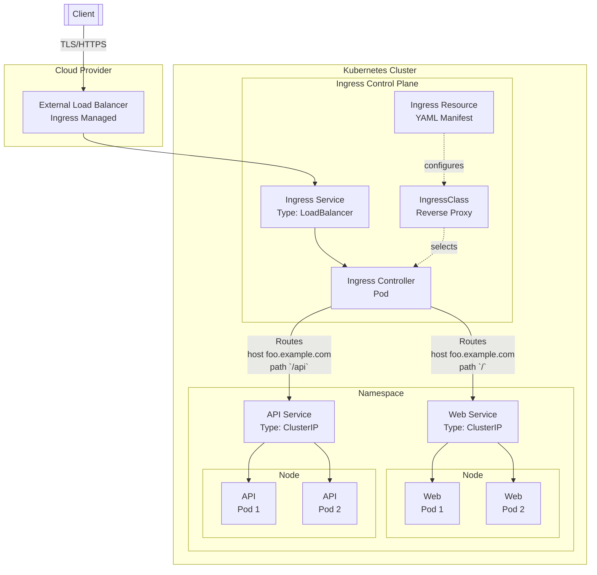

# Kubernetes

- [1. Details](#1-details)
  - [1.1. Charts](#11-charts)
  - [1.2. Architecture Diagrams](#12-architecture-diagrams)
  - [1.3. Order of Precedence](#13-order-of-precedence)
  - [1.4. Prerequisites](#14-prerequisites)
- [2. Usage](#2-usage)
  - [2.1. Authentication](#21-authentication)
    - [2.1.1. Kube Config](#211-kube-config)
  - [2.2. Cryptographic](#22-cryptographic)
    - [2.2.1. TLS Certificates and Private Keys](#221-tls-certificates-and-private-keys)
    - [2.2.2. CA-Signed Certificates from CSRs](#222-ca-signed-certificates-from-csrs)
- [3. Contribute](#3-contribute)
- [4. Troubleshoot](#4-troubleshoot)
  - [4.1. TODO](#41-todo)
- [5. References](#5-references)

## 1. Details

### 1.1. Charts

TODO

### 1.2. Architecture Diagrams

```mermaid
flowchart TD
    internet[[Client]]

    subgraph Cloud Provider
        lb[External Load Balancer<br>Ingress Managed]
    end

    internet --> |TLS/HTTPS| lb --> icService

    subgraph Kubernetes Cluster
        direction TB

        subgraph Ingress Control Plane
          ingressResource[Ingress Resource<br>YAML Manifest]
          ingressClass[IngressClass<br>Reverse Proxy]
          icService[Ingress Service<br>Type: LoadBalancer] --> ingressController[Ingress Controller<br>Pod]
          ingressResource -. configures .-> ingressClass -. selects .-> ingressController
        end

        subgraph Namespace
            serviceA[Web Service<br>Type: ClusterIP]
            serviceA --> podA1
            serviceA --> podA2
            subgraph node1[Node]
                podA1[Web<br>Pod 1]
                podA2[Web<br>Pod 2]
            end

            serviceB[API Service<br>Type: ClusterIP]
            serviceB --> podB1
            serviceB --> podB2
            subgraph node2[Node]
                podB1[API<br>Pod 1]
                podB2[API<br>Pod 2]
            end
        end

        ingressController --> |Routes<br/>host foo.example.com<br/>path `/` | serviceA
        ingressController --> |Routes<br/>host foo.example.com<br/>path `/api`| serviceB
    end
```

- Client
  > The *external* entity making an HTTP/HTTPS request to an application.

- Load Balancer
  > A *external* managed service provided by a cloud provider (AWS, GCP, Azure) outside of the Kubernetes cluster, created automatically by the Service of type `LoadBalancer`. Operates at Layer 4 (TCP/UDP) or Layer 7 (HTTP/HTTPS).

- Ingress Resource
  > A declarative Kubernetes API object that specifies routing rules (e.g., host-based, path-based) for external traffic. Centralized management as a single entry point for all HTTP/HTTPS traffic, security (TLS termination) and observability (logging, metrics).

- Ingress Service
  > A Kubernetes Service that targets the Pods of the Ingress Controller. Setting its type to `LoadBalancer`, instructs to provision an external load balancer to route traffic to the nodes on the specific `NodePort` of the service.

- IngressClass
  > A Kubernetes resource that defines the Ingress Controller to use for a specific Ingress Resource. It specifies the controller implementation (e.g., Nginx, Traefik) and its configuration.

- Ingress Controller
  > A reverse proxy server (Nginx, Traefik, or Envoy) running as a active component in a Pod within the cluster. Responsible for fulfilling the rules defined in the Ingress Resource.

- Services
  > - **LoadBalancer**: The Ingress Service of type `LoadBalancer` is created to provisions an external load balancer and expose the Ingress Controller to external traffic.
  > - **ClusterIP**: The Ingress Controller sends traffic to a regular Kubernetes Service of type `ClusterIP`. The Service is the internal default cluster communication to endpoints and load balancer, distributing traffic to the healthy Pods that match its *label selector*.

- Pods
  > The Ingress Controller routes traffic to internal ClusterIP Services, which then forward it to the application Pods.

### 1.3. Order of Precedence

Kustomize assembles and applies configuration in a defined hierarchy to ensure predictable overrides, lowest to highest:

- Base Resources
  > Loaded first from `resources:` in base kustomizations.

- Generators
  > ConfigMap- and Secret-generators (`configMapGenerator:`, `secretGenerator:`) produce new objects after base resources.

- Base Patches
  > Any `patches:` declared within base kustomizations are applied.

- Component Patches & Transformers
  > Imported via `components:`, these patches and transformers run next.

- Overlay Patches & Transformers
  > Specified in overlays (`patches:`, `transformers:`), they override earlier modifications.

- Overlay Direct Fields
  > Top-level settings in the overlay such as `namespace:`, `namePrefix:`, `commonLabels:`, `images:` are applied last, possessing the highest precedence.

### 1.4. Prerequisites

TODO

## 2. Usage

### 2.1. Authentication

#### 2.1.1. Kube Config

TODO

### 2.2. Cryptographic

#### 2.2.1. TLS Certificates and Private Keys

TODO

#### 2.2.2. CA-Signed Certificates from CSRs

TODO

## 3. Contribute

[CONTRIBUTING.md](CONTRIBUTING.md) provides guidens and instructions for contributing to the project.

- [AI Agents](CONTRIBUTING.md#1-ai-agents)
  > Automated tools that assist in various development tasks such as code generation, testing, and documentation.

- [Skills Manager](CONTRIBUTING.md#2-skills-manager)
  > CLI tool for managing AI agent skills in development projects.

- [Task Runner](CONTRIBUTING.md#3-task-runner)
  > Make automation tool that defines and manages tasks to streamline development workflows.

- [Bootstrap](CONTRIBUTING.md#4-bootstrap)
  > Scripts to bootstrap, setup, and teardown a software development workspace with requisites.

- [Dev Containers](CONTRIBUTING.md#5-dev-containers)
  > Consistent development environments using Docker containers.

- [Release Manager](CONTRIBUTING.md#6-release-manager)
  > Semantic-Release automates the release process by analyzing commit messages.

- [Update Manager](CONTRIBUTING.md#7-update-manager)
  > Renovate and Dependabot automate dependency updates by creating pull requests.

- [Secrets Manager](CONTRIBUTING.md#8-secrets-manager)
  > SOPS for managing and encrypting sensitive data such as passwords, API keys, and other secrets.

- [Container Manager](CONTRIBUTING.md#9-container-manager)
  > Docker containerization tool to run applications in isolated container environments.

- [Policy Manager](CONTRIBUTING.md#10-policy-manager)
  > Conftest for policy-as-code enforcement.

- [Supply Chain Manager](CONTRIBUTING.md#11-supply-chain-manager)
  > Trivy for security scanning of vulnerabilities, misconfigurations, and compliance issues.

## 4. Troubleshoot

### 4.1. TODO

TODO

## 5. References

- Sentenz [Kubernetes](TODO) article.
- Sentenz [Template DX](https://github.com/sentenz/template-dx) repository.
- Sentenz [Actions](https://github.com/sentenz/actions) repository.
- Sentenz [Manager Tools](https://github.com/sentenz/convention/issues/392) article.
